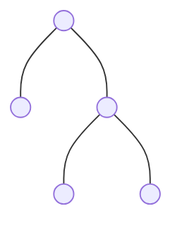
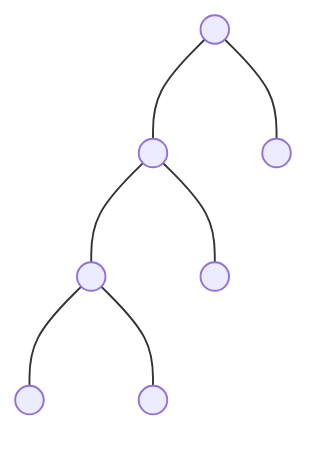
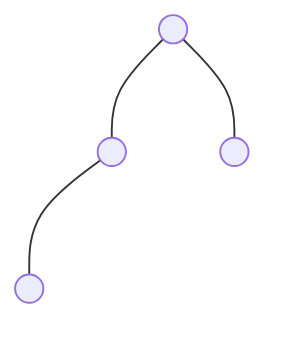
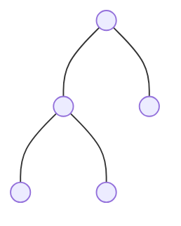
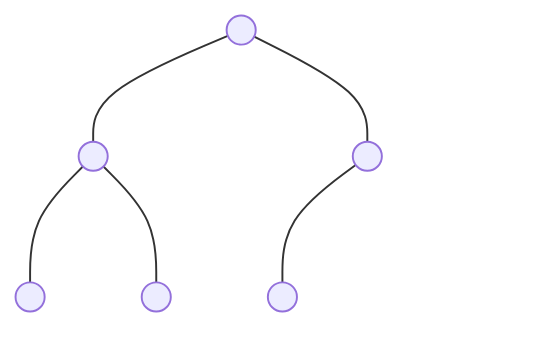
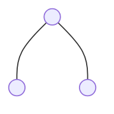
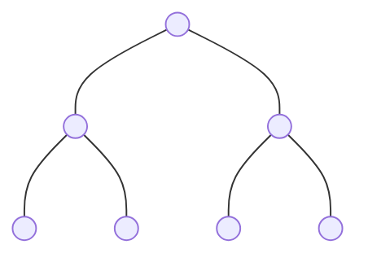

---
tags:
 - trees
title: "Complete vs. full vs. perfect binary trees"
#date: 2020-11-05 20:45:59
published: true
permalink: binary-trees
#sidebar:
#    nav: cryptomat
#article_header:
#  type: cover
#  image:
#    src: /pictures/.jpg
---

{: .info}
**tl;dr:** The terms _full_, _complete_, and _perfect_ binary tree are often confused with each other. In this short post, we define each one, give examples, and work out **all** the relationships between them --- including the perhaps-surprising fact that _full + complete does **not** imply perfect_.

Real quickly, the Venn diagram below shows how the three classes relate to each other: **Perfect** is a strict subset of **Full $\cap$ Complete**.

<!--more-->

<!-- Here you can define LaTeX macros -->

$
$
 <!-- $ -->

## Definitions

### Full binary tree

A **full** (a.k.a., **proper** or **strict**) binary tree is one where every node has **0 or 2 children**. In other words, no node has exactly one child.

**Example 1** --- A single node (trivially full):

**Example 2** --- A 5-node full tree:

**Example 3** --- A 7-node full tree that is **not** perfect (leaves at depths 1, 2, and 3):

### Complete binary tree

A **complete** binary tree must have two properties:
1. Every level is fully-filled **except possibly the last**,
2. The last level is filled **from left to right**.

{: .note}
This is the shape you get when you insert elements into a binary heap one by one.

**Example 1** --- A 4-node complete tree (note: **not** full, since the left child has only one child):

**Example 2** --- A 5-node complete tree (this one **is** also full):

**Example 3** --- A 6-node complete tree (note: **not** full, since the right child has only one child):

### Perfect binary tree

A **perfect** binary tree must have two properties:
1. **All** internal nodes have exactly 2 children,
2. All leaves are at the **same depth**.

{: .note}
A perfect binary tree of height $h$ has exactly $2^{h+1} - 1$ nodes.

**Example 1** --- Height 0 (1 node):

**Example 2** --- Height 1 (3 nodes):

**Example 3** --- Height 2 (7 nodes):

---

## Relationships

There are six pairwise implications to consider. Let's work through all of them.

### Full $\nRightarrow$ Complete

Counterexample: this tree is full (every node has 0 or 2 children), but **not** complete because the second level is not filled from left to right --- the right subtree is deeper than the left.

### Full $\nRightarrow$ Perfect

Counterexample: this full tree has leaves at depths 1 and 3, so it is **not** perfect.

### Complete $\nRightarrow$ Full

Counterexample: this 4-node complete tree has a node with exactly **one** child, violating fullness.

### Complete $\nRightarrow$ Perfect

Counterexample: this 5-node complete tree has leaves at depths 1 and 2.

### Perfect $\Rightarrow$ Full

By definition, every internal node of a perfect tree has exactly 2 children, which is exactly the requirement for fullness.

### Perfect $\Rightarrow$ Complete

In a perfect tree, _every_ level is completely filled (including the last). This trivially satisfies the definition of completeness.

### Full + Complete $\nRightarrow$ Perfect

Many people assume that if a tree is _both_ full and complete, then it must be perfect. **This is false.**

**Counterexample:** Consider this 5-node tree.

- **Full?** Yes --- every node has 0 or 2 children. ✅
- **Complete?** Yes --- levels 0 and 1 are fully-filled, and level 2 is filled from the left. ✅
- **Perfect?** No --- level 2 is not fully-filled $\Rightarrow$ all leaves are **not** at the same depth ❌

The key insight is that _completeness_ only requires the **last** level to be left-filled; it does **not** require the last level to be _fully_ filled. And _fullness_ only bans single-child nodes; it says nothing about leaf depths. Combined, the two properties are still not strong enough to force all leaves to the same depth.

#### When _does_ full + complete $=$ perfect?

When the number of nodes $n = 2^{h+1} - 1$ for some $h$ (i.e., the last level is fully-filled). In that case --- and only that case --- a complete tree is also perfect (and, trivially, also full).

---

